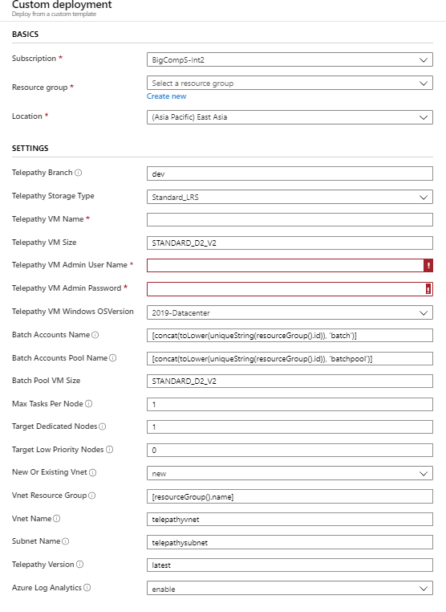
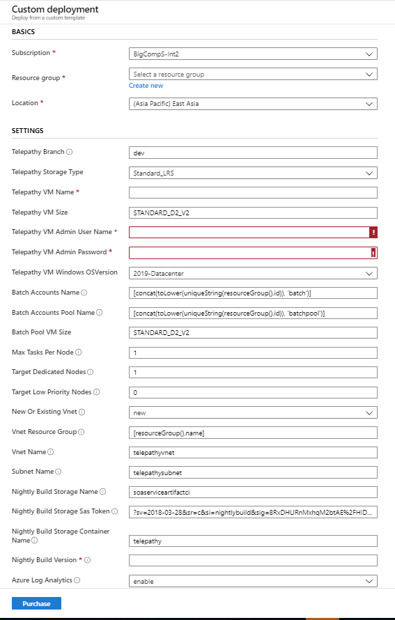
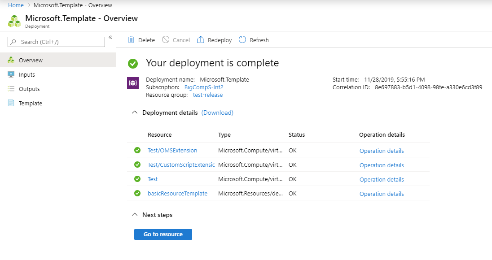
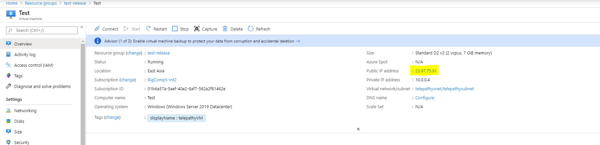
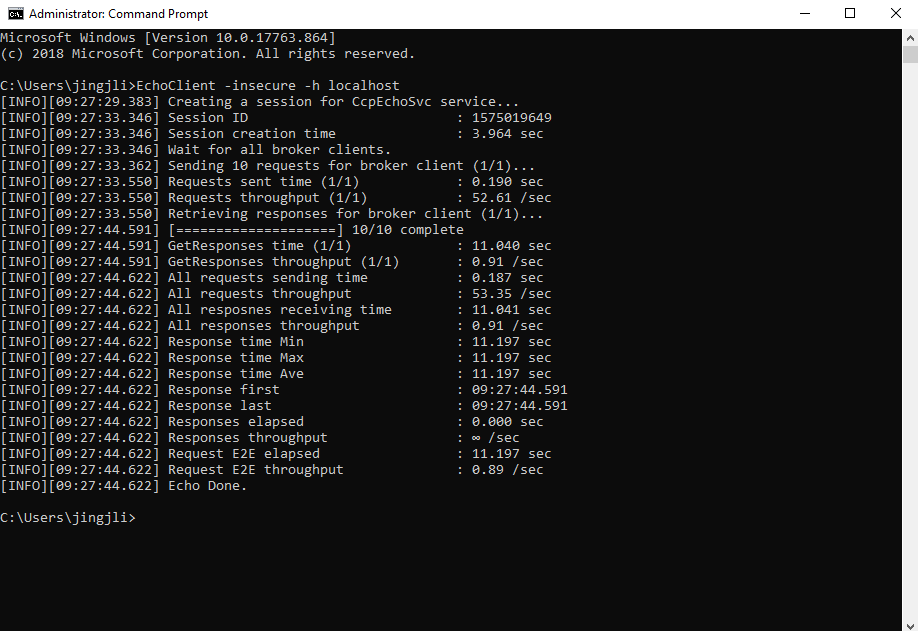

# Deploy a Telepathy Cluster Step by Step

Here are the steps to deploy a Telepathy cluster:

- Step 1: Create resources with ARM template

- Step 2: Deploy resources

- Step 3: Test the deployment result

## Step 1: Create resources with ARM template

Telepathy supports nightly build version deployment and release version deployment. The ARM templates for both have been provided to easy the process to start with Telepathy. Most parameters in ARM templates have default values, only some credential information should be filled manually.

### ARM Template for Release Version Deployment

The paramaters `Resource group`, `Telepathy VM Name`, `Telepathy VM Admin User Name` and `Telepathy VM Admin Password` must be filled to start release version deployment. The default release version to be deployed is `latest`, all the release versions can be viewed in [Github](https://github.com/Azure/Telepathy/releases).

### ARM Template for Nightly Build Deployment

The paramaters `Resource group`, `Telepathy VM Name`, `Telepathy VM Admin User Name`, `Telepathy VM Admin Password` and `Nightly Build Version` must be filled to start the nightly build deployment. All the nightly build versions are available in [Azure DevOps](https://dev.azure.com/bc-telepathy/telepathy/_build)

## Step 2: Deploy resources

Go to the corresponding resource group to view the deployment progress, it will take about 10 mins to finish the cluster deployment and start the Telepathy services.

## Step 3: Test the deployment result

### Log on the VM

Log on the VM which is created in Telepathy cluster using remote desktop connection. The public IP address can be find in Azure poratl, the username and password are the credentials that are filled in ARM template. 

### Run EchoClient

After Log on the VM, open the console and run the command `EchoClient -insecure -h localhost`, if the Telepathy cluster is ready, the Echo result should output in console like below:

### View Telepathy Services in Task Manager

The Telepathy Services should be found running in Task Manager.

