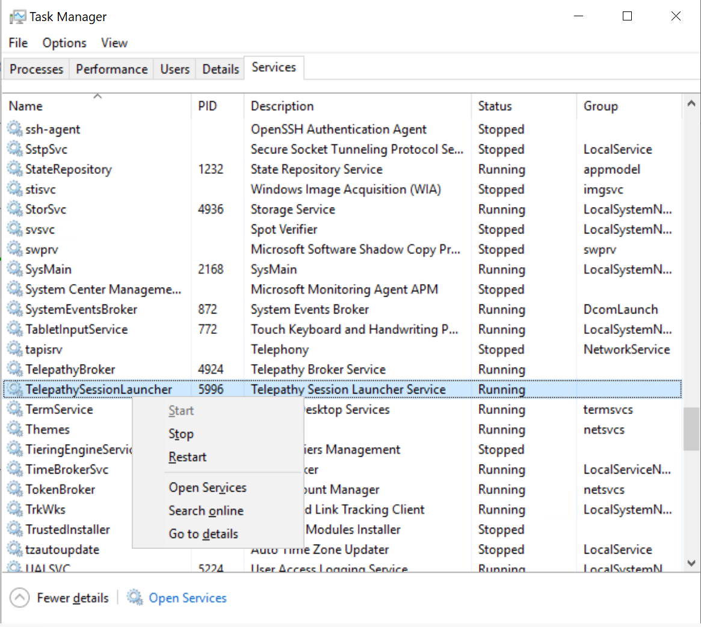

# Logging Configuration

## Logging Library in Telepathy

Telepathy use [Serilog](https://serilog.net/) as the diagnostic logging library. Serilog provides [sinks](https://github.com/serilog/serilog/wiki/Provided-Sinks) for writing log events in many output formats, like files, the console and some popular storage. 

## Telepathy Logging Configurations

Currently Serilog sinks that are supported in Telepathy:
1. [File](https://github.com/serilog/serilog-sinks-file)
2. [Console](https://github.com/serilog/serilog-sinks-console)
3. [Seq](https://github.com/serilog/serilog-sinks-seq)
4. [Azure Analytics](https://github.com/saleem-mirza/serilog-sinks-azure-analytics)

Telepathy set logging configuration in App.config files, which are **HpcSession.exe.config** in SessionLauncher, **HpcBroker.exe.config** in Broker and **HpcBrokerWorker.exe.config** in BrokerWorker, and these files can be find under *C:\telepathy*.

If it's a nightly build Telepathy cluster, the SessionLauncher configuration file is under the path of `C:\telepathy\build_number\Release\SessionLauncher`, the Borker and BrokerWorker configuration files are under the path of `C:\telepathy\build_number\Release\BrokerOutput`. If it's a release version Telepathy cluster, the SessionLauncher configuration file is under the path of `C:\telepathy\Release\SessionLauncher`, and the Borker and BrokerWorker configuration files are under the path of `C:\telepathy\Release\BrokerOutput`. 

Logging configuration sample in SessionLaucner: 
```xml
 <appSettings>
    <add key="serilog:enrich:with-property:Source" value="SessionLauncher" />
    <add key="serilog:minimum-level" value="Verbose" />
    <add key="serilog:using:File" value="Serilog.Sinks.File" />
    <add key="serilog:using:Console" value="Serilog.Sinks.Console" />
    <add key="serilog:write-to:Console" />
    <add key="serilog:write-to:Console.restrictedToMinimumLevel" value="Verbose" />
    <add key="serilog:using:Seq" value="Serilog.Sinks.Seq" />
    <add key="serilog:write-to:Seq.restrictedToMinimumLevel" value="Verbose" />
    <add key="serilog:write-to:Seq.serverUrl" value="http://localhost:5341" />
    <add key="serilog:using:AzureLogAnalytics" value="Serilog.Sinks.AzureAnalytics" />
    <add key="serilog:write-to:AzureLogAnalytics.restrictedToMinimumLevel" value="Verbose" />
    <add key="serilog:write-to:AzureLogAnalytics.workspaceId" value="b8a556de-686e-4c61-9ffa-5b74b2b7407f" />
    <add key="serilog:write-to:AzureLogAnalytics.authenticationId" value="******" />
    <add key="serilog:write-to:File.restrictedToMinimumLevel" value="Verbose" />
    <add key="serilog:write-to:File.path" value="C:\Logs\Session.json" />
    <add key="serilog:write-to:File.rollingInterval" value="Day" />
    <add key="serilog:write-to:File.formatter" value="Serilog.Formatting.Compact.CompactJsonFormatter, Serilog.Formatting.Compact" />
  </appSettings>
```

## Configure Logging Settings

When the Telepathy cluster is ready, the Console logging and File logging have configured with `Verbose` level by default. If Azure Analytics is enabled during deployment, the AzureLogAnalytics logging configuration with `Warning` level will be added in all configuration files. The File logging writes all logs in the path of `C:\Logs`, the deployment log is also in this directory.

### How to Configure Logging Settings

The Logging Settings can be configured directly in configuration files. But Telepathy has CLI to convienient the way to do logging setting modifications. The Serilog Sinks map to Telepaty CLI parameters are `ConsoleLogging`, `SeqLogging`, `AzureAnalyticsLogging` and `LocalFileLogging`.

#### Using Logging Configuration File
```console
HpcSession/HpcBroker/HpcBrokerWorker -l -f LoggingConfiguration.json
```

Below is the configuration file which covers all the possible logging settings in current Telepathy, please select the parameters in your own configuration file as you need:

```json
{
  "Logging": "Enable",
  "ConsoleLogging": true,
  "ConsoleLoggingLevel": "Verbose",
  "SeqLogging": true,
  "SeqLoggingLevel": "Verbose",
  "SeqServerUrl": "http://localhost:5341",
  "AzureAnalyticsLogging": true,
  "AzureAnalyticsLoggingLevel": "Verbose",
  "AzureAnalyticsWorkspaceId": "***",
  "AzureAnalyticsAuthenticationId": "***",
  "LocalFileLogging": true,
  "LocalFileLoggingLevel": "Verbose",
  "LocalFilePath": "C:\\Log\\Test.json",
  "LocalFileFormatter": "Serilog.Formatting.Compact.CompactJsonFormatter, Serilog.Formatting.Compact",
  "RollingInterval" : "Day"
}

```
> If the Logging value is Disable, Telepathy will not write any log in any output format. If one format Logging value is false, the detailed configurations about that Sink will be ignored.

#### Using Command Line Paramters

```console
HpcSession/HpcBroker/HpcBrokerWorker -l --Logging Enable --ConsoleLogging true --ConsoleLoggingLevel Verbose
```

**Restart the corresponding Telepathy Service to take effect in Task Manager after changing the Logging configuration.**




