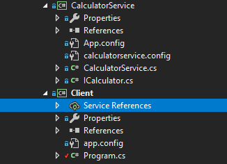
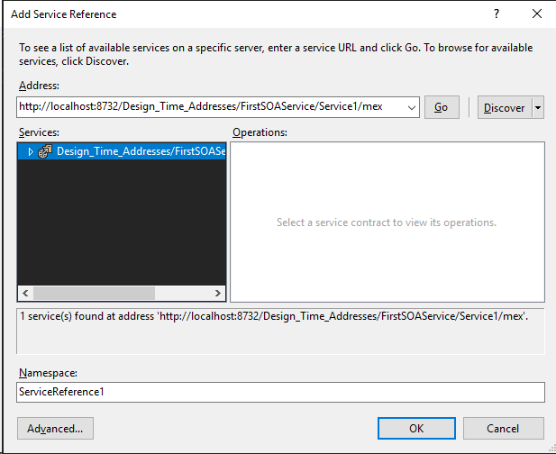
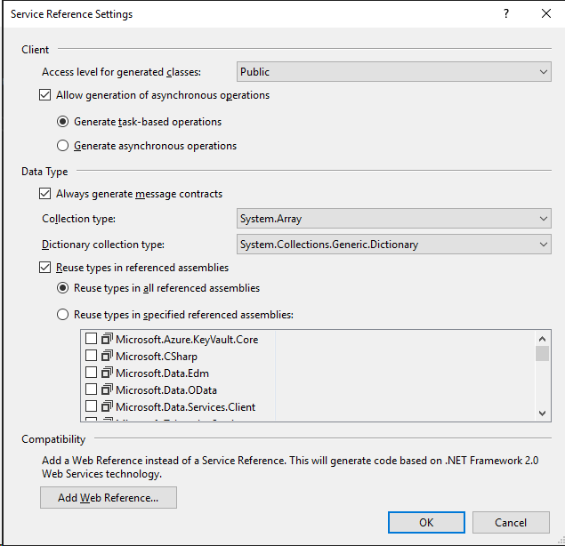
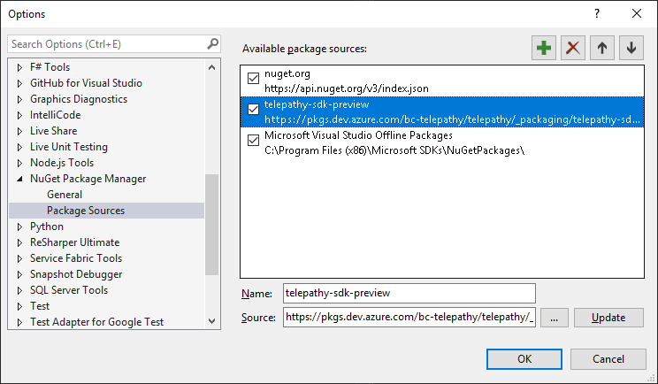
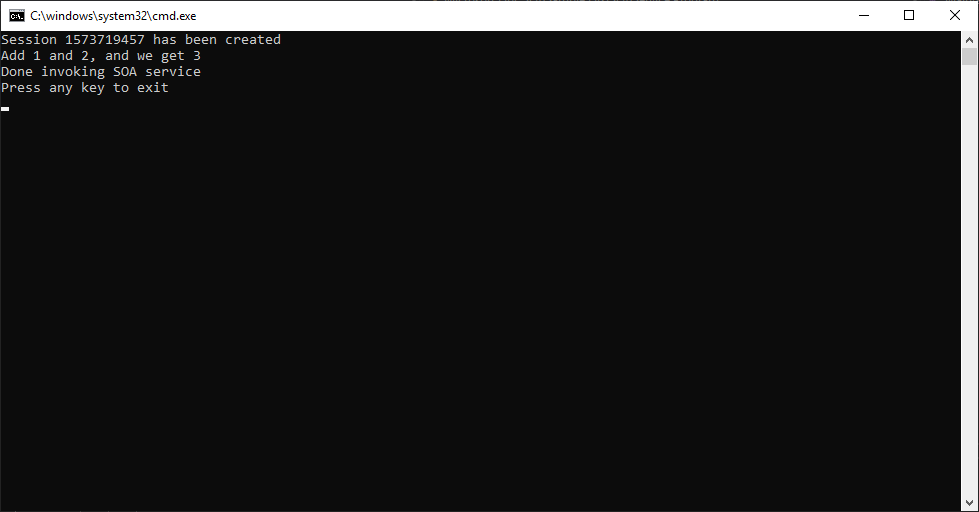
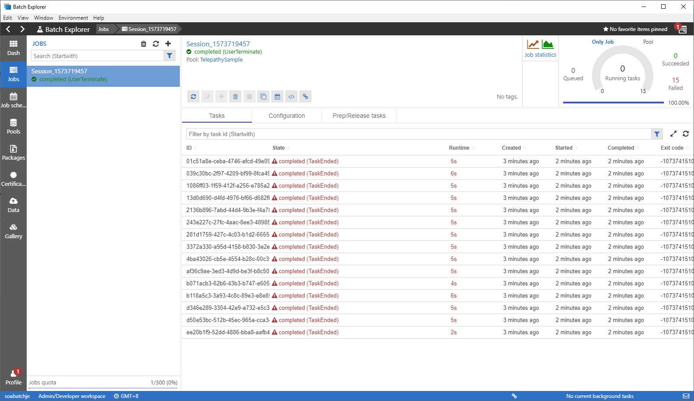

# Microsoft Telepathy SOA Tutorial I – Write your first SOA service and client

This series of tutorial introduces the SOA programming model for Microsoft Telepathy . This is the first tutorial of the series and provides guidance to write your first SOA service and client. See the [accompanying code sample](../../samples/Simple%20Service) to follow the steps in this article.

## What is a SOA service?

Service-oriented architecture (SOA) is an approach to building distributed, loosely coupled systems.

With SOA, distinct computational functions are packaged as software modules called services. Unlike traditional HPC applications, an SOA service exposes its functionality through a well-defined service interface which allows any application or process on the network to access the functionality of the service. Developers can implement service functionality by using any programming language, and can write original services or package existing dynamic-link libraries (DLLs) and IT investments as services.

## Why SOA services?

HPC applications are typically classified as "message intensive" or "embarrassingly parallel." Message-intensive applications comprise sequential tasks. Embarrassingly parallel applications can be easily divided into large numbers of parallel tasks, with no dependency or communication between them.

SOA services are designed to solve the embarrassingly parallel problem. Compared with traditional HPC computation models, SOA services provide the following advantages:

- Easier programming model: The interface of the SOA service is just a remote method. It makes the client application able to easily access the service.

- Easier message exchange: Traditional HPC jobs require dealing with input and output files. SOA services allow client applications to easily transfer data between the client application and service.

## Getting started

To write a SOA program to run on a Telepathy cluster, you need .net 4.6 or later and Visual Studio 2017.

To test your service you need to set up a Telepathy cluster to run your service. You can deploy a new cluster according to *[placeholder for deployment documentation]*.

Now we can start writing the SOA application. Let’s say we need a service running on the Telepathy cluster to do math calculations. Then we need a client program for end users, because they cannot directly access the cluster. The client program submits the calculation request to the service and returns the result to the end users. To simplify the code, let’s just use a simple addition calculation as an example.

Here are the steps to write a SOA application:

- Step 1: Implement the service

- Step 2: Deploy the service

- Step 3: Implement the client

- Step 4: Test the service

### Step 1: Implement the service

Following code can be found in the CalculatorService project in the [sample code](../../samples/Simple%20Service).

A SOA service is a [Windows Communication Foundation](http://go.microsoft.com/fwlink/?linkid=122573) (WCF) service running on the HPC cluster. The SOA service is ideal for writing interactive, embarrassingly parallel applications, especially for calculation of complex algorithms.

A SOA service does not require too much extra effort beyond your algorithm. It’s just a standard WCF service. The first step is to define the service contract, like the following code:

```csharp
[ServiceContract]
public interface ICalculator
{
    [OperationContract]
    double Add(double a, double b);
}
```

The only extra code is to add the attribute, which can be recognized by WCF, of the interface and its methods. With the service contract the client can understand how to invoke the method and what parameters are required.

The next step is to implement the algorithm of the service:

```csharp
public class CalculatorService : ICalculator
{
     public double Add(double a, double b)
     {
        return a + b;
     }
}
```

### Step 2: Deploy the service

We need to deploy the service we just created to the HPC cluster. Before we deploy the service, we need one more step which is creating the SOA service configuration file. Create an XML file like the following:

```xml
<?xml version="1.0" encoding="utf-8"?>

<configuration>
  <configSections>
    <sectionGroup name="microsoft.Hpc.Session.ServiceRegistration"
                  type="Microsoft.Telepathy.Session.Configuration.ServiceRegistration, Microsoft.Telepathy.Session">
      <section name="service"
               type="Microsoft.Telepathy.Session.Configuration.ServiceConfiguration, Microsoft.Telepathy.Session"
               allowDefinition="Everywhere"
               allowExeDefinition="MachineToApplication" />
    </sectionGroup>
  </configSections>
  <microsoft.Hpc.Session.ServiceRegistration>
    <!--Change assembly path below-->
    <service assembly="%TELEPATHY_SERVICE_WORKING_DIR%\CalculatorService\CalculatorService.dll">
    </service>
  </microsoft.Hpc.Session.ServiceRegistration>
</configuration>
```

Note that the name of the XML file must be as same as the service name, and must be lowercase. In this case, name it `calculatorservice.config`.

Now copy the service configuration file to the configuration blob container, which is a blob container named **service-registration** in the Azure Storage Account linked to your Telepathy cluster. Next step is to  create a folder **calculatorservice** in **service-assembly** container in the same Storage Account, and copy the DLL file into the folder. You can use tools like [Azure Storage Explorer](https://azure.microsoft.com/en-us/features/storage-explorer/) to access both two containers. 

### Step 3: Implement the client

Following code can be found in the Client project in the [sample code](../../samples/Simple%20Service). 

Now we need a client program to submit the calculation request. The client needs to invoke the service we just created remotely, so we need to leverage WCF to generate the proxy class for us. Visual Studio can simplify the whole process by using its service references functionality.

The suggested project organization in Visual Studio is to create different projects for the service and client programs, as shown in the following figure:



We need to generate the proxy class for the client program based on the 
CalculatorService. Make sure the service project has been successfully 
built then click **Add Service Reference**, click **Discover**, and you should see the service you just created. Select the service and click **Advanced**.



**Important**: In the advanced **Service Reference Settings** dialog box, ensure that **Always generate message contracts** is selected.



Now we can write the client code:

1. Reference `Microsoft.Telepathy.Session` NuGet package in the client project.
    *[Placeholder for release package]*

      To use nightly SDK package, add following NuGet source.

      - Name: telepathy-sdk-preview
      - Source: https://pkgs.dev.azure.com/bc-telepathy/telepathy/_packaging/telepathy-sdk-preview/nuget/v3/index.json

      Check [Add the feed to your NuGet configuration](https://docs.microsoft.com/en-us/azure/devops/artifacts/nuget/consume?view=azure-devops) for detailed instruction.

      

1. Prepare the session info, which includes the head node address and the service name. Let’s assume the head node host name is head.contoso.com and we are using the CalculatorService.

    ```csharp
    SessionStartInfo info = new SessionStartInfo("head.contoso.com", "CalculatorService");
    ```

1. With the SessionStartInfo object we can create a session to connect to the head node.

   ```csharp
   using (Session session = Session.CreateSession(info)) {……}
   ```

1. To be able to send requests and receive responses, you need to create a BrokerClient object.

   ```csharp
   using (Session session = Session.CreateSession(info))
   {
       using (BrokerClient<ICalculator>client = new BrokerClient<ICalculator>(session)) {……}
   }
   ```

1. With the BrokerClient, you can send requests and receive responses.

   ```csharp
   using (BrokerClient<ICalculator>client = new BrokerClient<ICalculator>(session))
   {
       //send request
       AddRequest request = newAddRequest(1, 2);
       client.SendRequest<AddRequest>(request);
       client.EndRequests();

       //get response
       foreach (BrokerResponse<AddResponse>response in client.GetResponses<AddResponse>())
     {
        double result = response.Result.AddResult;
        Console.WriteLine("Add 1 and 2, and we get {0}", result);
     }
   }
   ```

### Step 4: Test the service

Now you can test your service using your client program.

Run the client in the Visual Studio. If everything is working fine, you should see output like the following:




By default we use Azure Batch Service as our backend. You can see the corresponding batch job through [Batch Explorer](https://azure.github.io/BatchExplorer/) or [Azure Portal](https://portal.azure.com/).



Congratulations! You have successfully created and run your first SOA service. In our next tutorial, we will introduce way of writing a service to handle a batch of client requests.
