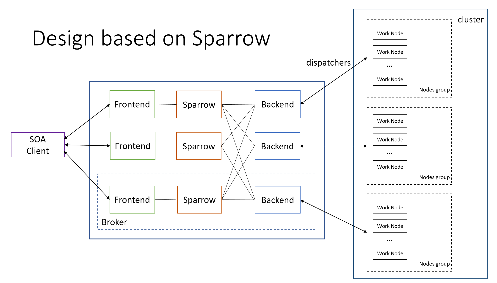

# HA Distributed Brokes PoC Design for Telepathy based on Sparrow 

## Backgroud

Currently Telepathy only supports 1 Broker to receive clients' requests and dispatch requests to cluster nodes. The centralized design for Broker leads to some limitations of scalability and availability are shown as below:
1. The maxmimun throughput of handling messages for 1 Broker is ~30k/s
2. The maxmimum core number supports by 1 Broker is ~10k
3. Once the Broker fails, the clients' request can't be handled

To support larger size of clients' requests and cores number, as well as tolerate Broker failure, we bring some new insights from [Sparrow](https://cs.stanford.edu/~matei/papers/2013/sosp_sparrow.pdf ) into our Telepathy project.




## PoC Design

Sparrow is a decentralized, randomized sampling approach to enable stateless distributed, low latency task scheduling. The scheduling approach proposed in Sparrow can be concluded in 3 aspects: 
1. Batch sampling
2. Late binding
3. Proactive cancellation

Due to the homogeneousness of SOA requests and based on our scenario, we make some improvements in scheduling in our PoC design:
1. Send probes to all worker nodes
2. Achieve late binding by making reservations for Brokers not jobs

 In the PoC project, every task will send probes to all worker nodes, but the multiple reservation request only take effect once for the same Broker. As long as one Broker has tasks, the nodes will repeat requesting the maximum number of tasks they can execute right now. Only no task left in the Broker,  the worker nodes remove the reservations of the empty Broker, then acquire tasks from another Broker which has made reservation before.

The design architecture of PoC is as simple as below:


There are 3 Sheduler servers and 5 Worker servers in our PoC project. The Client requests are sent to the 3 schedulers randomly. And we adopt gRPC as our remote procedure call framework.


## Try by Yourself

### Prerequisites

Install [.NET Core commadn-line interface tools](https://docs.microsoft.com/en-us/dotnet/core/tools/?tabs=netcore2x)

### Run with PowerShell Script

 Open the PowerShell in your computer and direct to the PoC project folder, run with the command `./start.ps1`.

 > The default task execution time is *1000ms* set in the **ExcuteTask** method in *WorkerServer/Services/WorkerService.cs* and SchedulerClient uses this value to calculate task execution efficiency. The default task number set in SchedulerClient is *1000*.


### Scheduling Result

The scheduling result is in *TestFolder/result.txt*.

```
*******************Start******************
https://localhost:50055 executed 201 tasks.
https://localhost:50056 executed 198 tasks.
https://localhost:50057 executed 202 tasks.
https://localhost:50058 executed 200 tasks.
https://localhost:50054 executed 199 tasks.
Actual elapsed time is 103205ms
Supposed elapsed time is 100000ms
Efficiency in this test is 96.89453030376434%
*******************End******************
```


